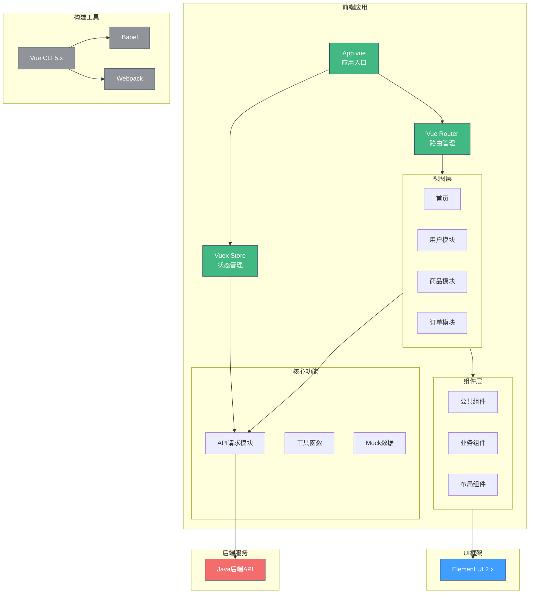

# vue-st-junw

Vue2学习项目

## 系统架构

```mermaid
graph TB
    subgraph Frontend["前端应用"]
        App[App.vue<br/>应用入口]
        Router[Vue Router<br/>路由管理]
        Vuex[Vuex Store<br/>状态管理]
        
        subgraph Views["视图层"]
            Home[首页]
            User[用户模块]
            Product[商品模块]
            Order[订单模块]
        end
        
        subgraph Components["组件层"]
            CommonComp[公共组件]
            BusinessComp[业务组件]
            LayoutComp[布局组件]
        end
        
        subgraph Core["核心功能"]
            API[API请求模块]
            Utils[工具函数]
            MockData[Mock数据]
        end
    end
    
    subgraph UI["UI框架"]
        ElementUI[Element UI 2.x]
    end
    
    subgraph Build["构建工具"]
        VueCLI[Vue CLI 5.x]
        Babel[Babel]
        Webpack[Webpack]
    end
    
    subgraph Backend["后端服务"]
        JavaAPI[Java后端API]
    end
    
    App --> Router
    App --> Vuex
    Router --> Views
    Views --> Components
    Views --> API
    Vuex --> API
    Components --> ElementUI
    API --> JavaAPI
    VueCLI --> Babel
    VueCLI --> Webpack
    
    classDef frontendStyle fill:#42b983,stroke:#35495e,color:#fff
    classDef uiStyle fill:#409eff,stroke:#35495e,color:#fff
    classDef backendStyle fill:#f56c6c,stroke:#35495e,color:#fff
    classDef buildStyle fill:#909399,stroke:#35495e,color:#fff
    
    class App,Router,Vuex frontendStyle
    class ElementUI uiStyle
    class JavaAPI backendStyle
    class VueCLI,Babel,Webpack buildStyle
```